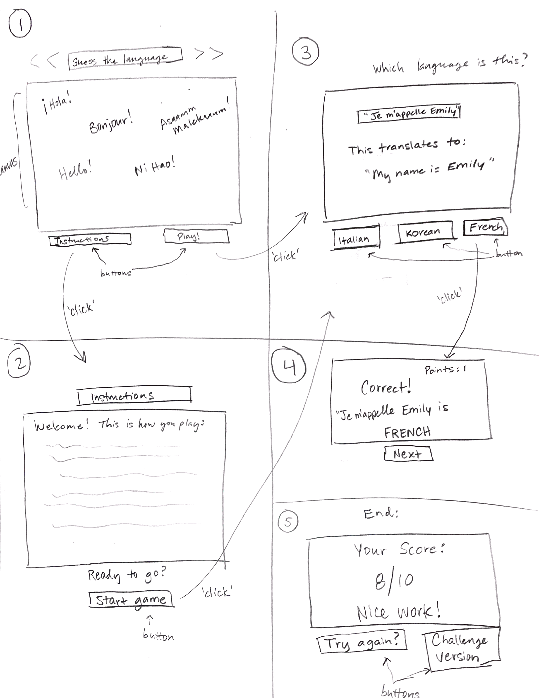

# language-quiz-game

Elevator pitch:
"There are over 7,000 languages spoken around the globe. Think you could identify some of them? Test your knowledge of different languages using this fun game! You'll be given phrases from random languages and it's up to you to identify them to earn points. Learn as you go with English translations given for each phrase. Play against yourself to beat your high score!"

About the Game:
This game will involve one phrase at a time popping up on the canvas screen. The player will need to guess between three language options to guess the correct language. If they are correct, they get one point. If not, they do not receive a point. There will be 10 phrases. Score will be number correct out of 10.

Tech stack used:
- Html (Canvas)
- CSS
- Javascript

Wireframes:
<!-- local image -->

MVP Goals:
- Render the starting screen with canvas, instruction button, and start button
- On 'instructions' click, render instruction page with directions in the canvas
- on 'play' click, render new canvas with 'guess' button
- Render 1 phrase at a time to appear on the screen, from a fixed list of 10 phrases, with the English translation below
- Render 3 buttons with 3 different language option choices for user to choose from
- User clicks correct language that matches phrase --> render 'correct' screen and add 1 point, render 'next' button
- User clicks incorrect language --> render 'unlucky' screen and show current score, render 'next' button
- Game ends after the 10 phrases have been clicked through
- End screen rendered with ending score, and two buttons for 'try again' and 'instructions'

Stretch Goals:
- Input box for users to free type their language guess
- Add more phrases and incorporate a timer to see how many points a player can get within a specific timeframe
- Keep track of high scores so player can play against his best score
- Each phrases will be floating down slowly in the canvas and player must type in language before they reach the bottom edge, or else it counts as a loss.
- Difficulty levels depending on the phrases, with easy, medium, and hard
- Include a @media query for mobile devices and smaller screens

Potential roadblocks:
- 
